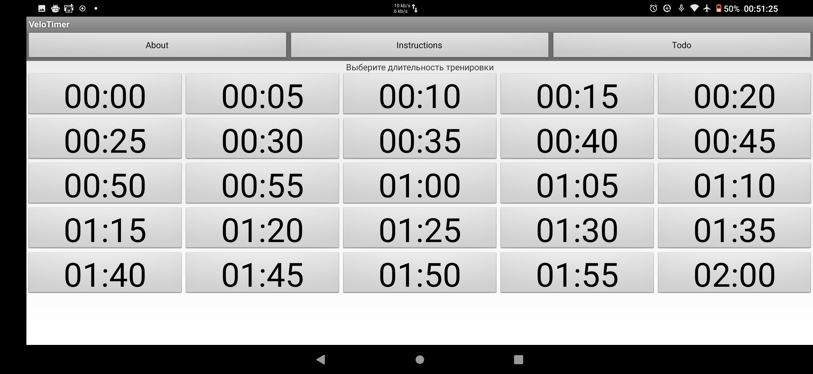

# VeloTimer
Я написал приложение-таймер для занятий на велотренажере.

Я очень ленивый, заниматься у меня нет никакой мотивации. Но я слишком зарос жиром и дальше или занятия спортом, или крематорий. Выбора нет. И я написал это небольшое приложение. Конечно же, тоже через боль и прокрастинацию

Во время тренеровки на велотренажере:
1. я хочу знать точно, когда она наконец-то закончится, даже если я занимаюсь всего 30 секунд.
2. после педалирования уже 10 минут, я весь покрываюсь потом, глаза закатываются и я просто не могу смотреть на таймер. А знать, когда это закончится - надо.
3. Хотелось бы как-то подкреплять прогресс и получать перки. Знать отдельно, что такие великие вехи, как 1/3 или половина пути уже пройдены.

Именно это и делает это приложение. Не больше и не меньше.

Обзор в видео + демо: https://www.youtube.com/watch?v=C1mp-5BRQdA
